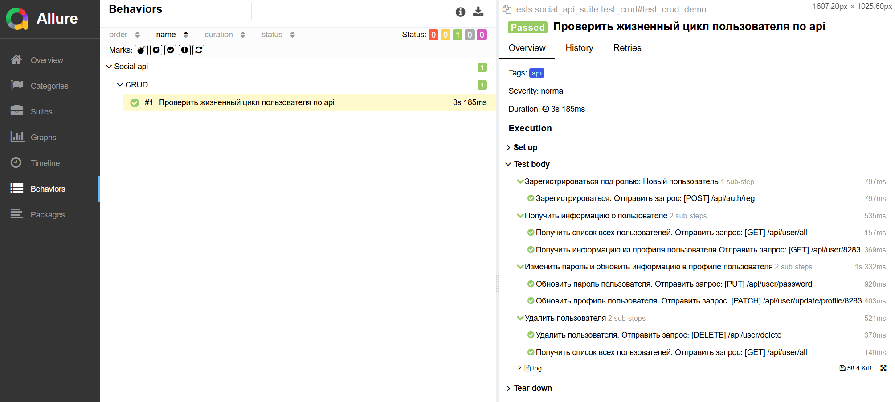

# Api Testing Framework
[](https://www.python.org/)
[](https://docs.pytest.org/)
[](https://requests.readthedocs.io/)
[](https://playwright.dev/)
[](https://allurereport.org/)

## Демо проекта по автоматизированному тестированию REST API.
Проект демонстрирует подход к построению архитектуры тестового фреймворка с разделением ответственности: 
* HTTP-клиент с логированием, который можно масштабировать под разные сервисы
* Сервисный слой для бизнес-логики
* Модели данных и изолированные тесты на pytest
* Реализован полный CRUD-сценарий жизненного цикла пользователя.
## Технологический стек
- **Python 3.14** — Язык программирования
- **pytest** — Тест-раннер
- **requests** — Библиотека для API-запросов
- **jsonpath** — Поиск данных в JSON-ответах
- **dataclasses** — Модели данных
- **faker** — Генерация тестовых данных
- **allure** — Система отчетности

## Запуск api-тестов

```bash
pip install -r requirements.txt

# Запуск одного теста
pytest tests/api/ --alluredir=allure-results

# Запуск тестов в параллельном режиме(если тестов больше, чем 1)
pytest tests/api/ -n auto --alluredir=allure-results

# Генерация страницы с отчётом
allure serve allure-results
```
## Отчёт:


---